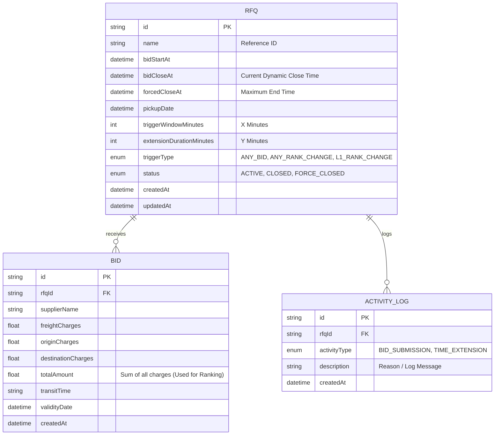

# British Auction in RFQ System - High Level Design & Schema

## 1. High Level Design (HLD)

### System Architecture Overview
The system follows a standard 3-tier architecture with a React-based frontend, a Node.js/Express backend, and a relational database (SQLite for local development, easily scalable to PostgreSQL for production).

```mermaid
flowchart TD
    Client[Web Client (React / Next.js)] -->|HTTP REST API| API[API Gateway / Express Router]
    Client -.->|WebSocket (Optional / Future)| API
    
    subgraph Backend [Node.js Backend]
        API --> AuctionService[Auction Service]
        API --> BidService[Bid Service]
        
        AuctionService --> CoreLogic{Extension Engine}
        BidService --> CoreLogic
    end
    
    subgraph Database Layer
        CoreLogic --> ORM[Prisma ORM]
        ORM --> DB[(Relational DB)]
    end
    
    CoreLogic -.-> |Validation: Forced Close Time| ORM
    CoreLogic -.-> |Trigger Check: Window & Type| ORM
```

### Key Components
1. **Frontend**: Single Page Application (SPA) providing UI for RFQ Creation, Listing, and Bidding (Details Page).
2. **Backend Services**:
   - **RFQ/Auction Service**: Manages creation, listing, and status updates of RFQs.
   - **Bid Service**: Handles incoming bids, calculates total amounts, and triggers the Extension Engine.
   - **Extension Engine (Core Logic)**: Evaluates business rules upon every bid:
     - Is the bid within the `Trigger Window`?
     - Does it satisfy the `Trigger Type` (Any Bid, Any Rank Change, L1 Rank Change)?
     - If yes, extend the `Close Time` by `Extension Duration`, but never exceeding the `Forced Close Time`.
3. **Database**: Stores RFQs, Bids, and Activity Logs.

---

## 2. Database Schema Design

We use a relational database to ensure ACID properties for bids and auction times. Below is the schema representation.



### Table Details
- **RFQ**: Represents the Request for Quotation. `bidCloseAt` is dynamic and gets updated by the Extension Engine. `status` is evaluated dynamically based on the current time vs `bidCloseAt`.
- **Bid**: Represents a quote submitted by a supplier. `totalAmount` is calculated prior to insertion to quickly query ranks (L1, L2...).
- **Activity Log**: An append-only audit trail capturing every bid and time extension event, ensuring transparency for the auction details page.
