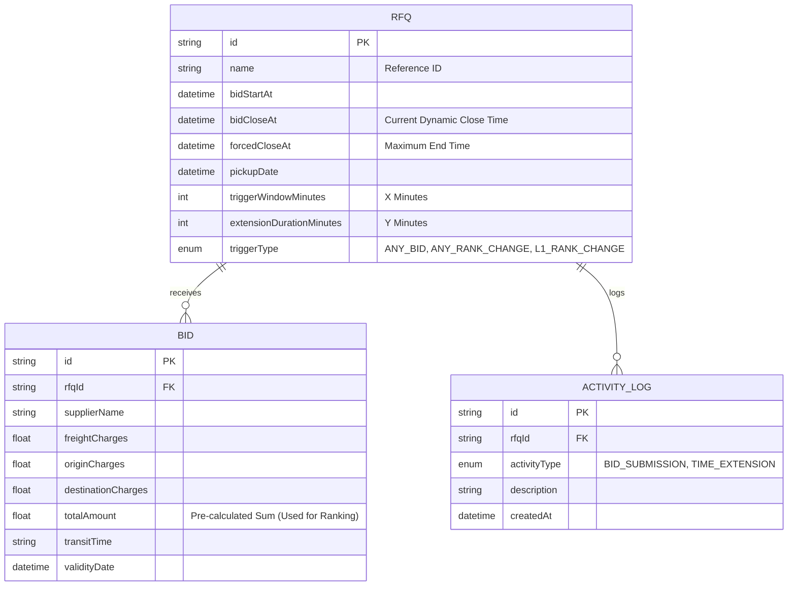

# British Auction RFQ System

## 1. Project Overview
This project is a Full-Stack Request for Quotation (RFQ) platform built around a **British Auction** model. The system ensures transparent and fair competition among suppliers by preventing last-minute "sniping" (where a supplier undercuts competitors at the final second with no time for retaliation). 

To achieve this, the platform features an **Auto-Extension Engine** that monitors bidding activity during a configurable trigger window and dynamically extends the auction's closing time if specific conditions are met, up to a hard-capped forced close time.

## 2. Technology Stack & Architecture

The system utilizes a standard 3-tier architecture optimizing for development speed, clear separation of concerns, and rapid UI prototyping.

- **Frontend (Presentation Layer):** Next.js (React) + Tailwind CSS. 
  - *Rationale:* Next.js provides robust routing and server-side rendering capabilities. Tailwind CSS enabled the rapid development of a premium, glassmorphism-inspired UI without the overhead of maintaining complex stylesheets.
- **Backend (Application Layer):** Node.js + Express.js. 
  - *Rationale:* The event-driven, non-blocking I/O model of Node.js is inherently suited for highly concurrent operations like processing rapid, simultaneous bids. Express provides a lightweight, unopinionated routing framework.
- **Database (Data Layer):** SQLite + Prisma ORM. 
  - *Rationale:* SQLite was selected to allow the evaluator to clone and run the project instantly without requiring external database server configuration. Prisma ORM guarantees strict type safety between the schema and the backend controllers.

### High-Level Design (HLD)

```mermaid
flowchart TD
    Client[Web Client (React / Next.js)] -->|HTTP REST API| API[API Gateway / Express Router]
    
    subgraph Backend [Node.js Backend]
        API --> AuctionService[Auction Service]
        API --> BidService[Bid Service]
        
        AuctionService --> CoreLogic{Extension Engine}
        BidService --> CoreLogic
    end
    
    subgraph Database Layer
        CoreLogic --> ORM[Prisma ORM]
        ORM --> DB[(SQLite DB)]
    end
    
    CoreLogic -.-> |Validation: Forced Close Time| ORM
    CoreLogic -.-> |Trigger Check: Window & Type| ORM
```

## 3. Database Schema & Data Modeling

The database is structured to ensure data integrity while optimizing for the read-heavy nature of an auction platform (where users frequently refresh to view leaderboard changes).



### Key Data Modeling Decisions:
1. **Dynamic `bidCloseAt`**: Rather than calculating the closing time on the fly by parsing activity logs, `bidCloseAt` is stored directly on the `RFQ` table as a mutable column. This allows the frontend to query the remaining time with a simple, O(1) lookup.
2. **Pre-calculated `totalAmount`**: Instead of having the database dynamically sum freight, origin, and destination charges on every read, the backend calculates `totalAmount` prior to insertion. This makes querying the lowest bidder (L1) an extremely fast `ORDER BY totalAmount ASC` operation.
3. **Computed Statuses**: The auction status (Active, Closed, Force Closed) is intentionally *not* persisted in the database. Instead, it is computed dynamically by the backend comparing the server's current timestamp against `bidCloseAt` and `forcedCloseAt`. This eliminates the need for complex cron jobs and guarantees 100% status accuracy.

## 4. The Extension Engine (Core Algorithm)

The auto-extension logic resides in the `POST /api/rfq/:id/bids` endpoint and strictly evaluates every incoming bid against the configured RFQ rules.

**Execution Flow:**
1. **Time Validation:** The engine verifies that the server's current time has not surpassed the `bidCloseAt` or `forcedCloseAt` times. If the auction is closed, the API rejects the request to ensure data integrity.
2. **State Snapshot:** The engine fetches the existing bids (ordered by price) to establish a "before" state of the leaderboard.
3. **Commit Bid:** The new bid is persisted securely to the database.
4. **Trigger Evaluation:** The engine checks if the current time falls within the configured `Trigger Window`. If it does, it evaluates the `triggerType`:
   - `ANY_BID`: Automatically extends the auction.
   - `ANY_RANK_CHANGE`: Re-evaluates the leaderboard. If an existing supplier shifts rank or the total bid count increases, it extends the auction.
   - `L1_RANK_CHANGE`: Compares the lowest bidder from the snapshot against the new lowest bidder. If the ID changes, it extends the auction.
5. **The Hard Cap (Clamp):** If an extension is triggered, the engine calculates the `proposedCloseAt` (Current Close Time + Extension Duration). If this proposed time exceeds the `forcedCloseAt` time, the engine strictly clamps the actual closing time to the `forcedCloseAt` boundary.
6. **Audit Logging:** The `RFQ` table is updated, and a `TIME_EXTENSION` log is generated detailing the exact reason for the extension to ensure full transparency for the buyers and suppliers.

## 5. Production Considerations & Scalability (Phase 2.0)

While this MVP was developed to fulfill the assignment requirements efficiently, bringing this system to a production environment would involve the following architectural upgrades:

1. **Handling High Concurrency (Database Locks):**
   In a high-traffic production scenario, multiple suppliers might bid in the exact same millisecond. To prevent race conditions where the system might read an outdated `bidCloseAt` time, I would migrate from SQLite to PostgreSQL and implement **Pessimistic Row-Level Locking**. By wrapping the bid submission in a transaction with a `SELECT ... FOR UPDATE` clause, the database would guarantee sequential processing of concurrent bids for the same RFQ.

2. **Real-Time Communication (WebSockets):**
   The current frontend uses a short-polling interval (`setInterval`) to fetch the latest leaderboard. At scale, this would generate unnecessary network overhead. For Phase 2, I would implement WebSockets (via Socket.io) coupled with Redis Pub/Sub. The Express server would emit a payload directly to subscribed clients the exact millisecond a new bid is committed, eliminating API polling entirely.

3. **Read-Heavy Optimization:**
   Because auctions generate exponentially more reads than writes, I would implement a **Read-Aside Cache using Redis**. The sorted leaderboard would be cached in memory, and the backend would only query the primary PostgreSQL database upon a cache miss, immediately updating the cache when a successful bid is written.

## 6. Local Setup & Execution

### Prerequisites
- Node.js (v18 or higher)
- npm

### Running the Backend
1. Open a terminal and navigate to the `backend` directory.
2. Run `npm install` to install dependencies.
3. Run `npx prisma db push` to initialize the local SQLite database.
4. Run `npm run dev` to start the Express server on `http://localhost:3001`.

### Running the Frontend
1. Open a separate terminal and navigate to the `frontend` directory.
2. Run `npm install` to install dependencies.
3. Run `npm run dev` to start the Next.js application on `http://localhost:3000`.
